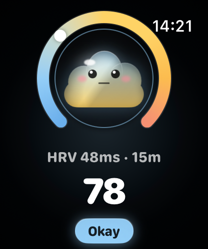
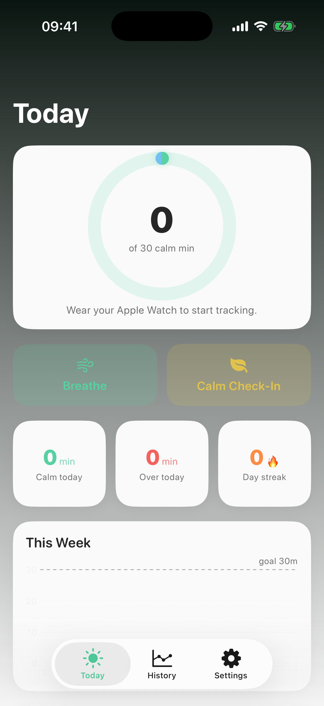

# Mochi

Mochi is a kawaii **stress & calm coach** for Apple Watch, with an iPhone
companion. The watch reads heart rate / HRV, turns it into a simple stress
score, and grows a mochi-cloud pet that reflects how calm your day has been.
The phone mirrors the synced data as daily calm-minutes, history, and trends.

## Showcase

| Watch — live stress + pet | iPhone — Today dashboard |
| --- | --- |
|  |  |

- **Watch**: stress ring (calm↔over), mascot reacting to state, HRV readout, 0–100 score, status pill.
- **iPhone**: calm-minutes goal ring, Breathe / Calm Check-In, Calm/Over/Streak stats, weekly trend, History & Settings tabs.

## Architecture

Single `Mochi.xcodeproj` with five product targets sharing a sync contract.

| Target | Role |
| --- | --- |
| **Mochi Watch App** | Primary app: sensors, stress scoring, pet, breathe flow |
| **Mochi iOS** | iPhone companion: calm-minutes, history, settings, App Intents |
| **Mochi Complication** | Watch face stress-pet complication |
| **Mochi Summary Widget** | iOS home-screen daily summary widget |
| **Shared** | `SummarySnapshot` + `WatchSyncMessage` sync contract |

The **watch is the sole sensor**; real `StressSample` + summaries reach the
phone over WatchConnectivity, so iOS holds no HealthKit dependency.

```
Mochi Watch App/
  Model/      StressState, StressSample, PetViewModel, EvolutionStage, PetMaturity, Breath*
  Services/   HeartRateService, OverSustainTracker, StressNotifier, WatchSyncSender
  Views/      StressRingView, PetView, BreathView, SummaryView, Settings, Onboarding
  Theme/      Palette  ·  Support/ DailySummaryStore, OnboardingState
Mochi iOS/
  Views/      DashboardView, GoalRingView, *HistoryChart, WeeklyTrendChart, Settings
  Services/   BreathTimer, CalmReminderScheduler, PhoneSyncReceiver, Summary{Store,Writer}
  Data/       DailyMinutesStore, InsightsEngine, StressHistoryReader  ·  Intents/ MochiIntents
Shared/       SummarySnapshot, WatchSyncMessage
```

## Brand

Catalog-backed tokens (light/dark) ship in both apps — see `Brand.md`:
`BrandPrimary` peach, `BrandAccent` blue, `CalmGreen`, `OverOrange`.

## Build

```bash
xcodebuild \
  -project Mochi.xcodeproj \
  -scheme "Mochi Watch App" \
  -destination 'platform=watchOS Simulator,name=Apple Watch Series 10 (46mm)' \
  -configuration Debug \
  build
```
Fall back to `generic/platform=watchOS Simulator` if that watch model is absent.

## Status

Watch + iOS run on simulator; iPhone-only, no iPad. App Store blockers cleared
(iOS HealthKit removed, privacy policy authored). Submission notes in `PRIVACY.md`.
